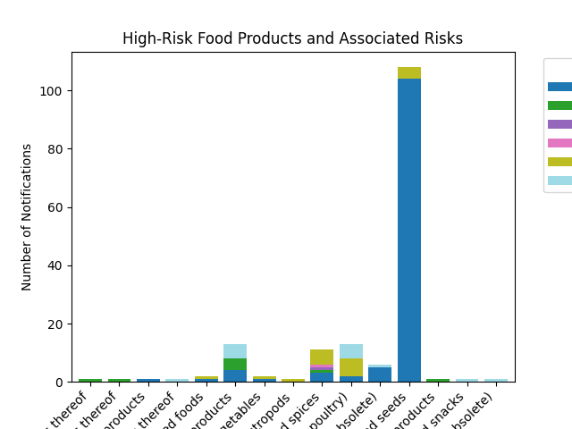

# HiCi_Food_Export_CaseStudy
Analysis of EU Food Safety data to identify high-risk food products and export risks for HiCi Ltd.
# HiCi Ltd EU Food Export Analysis

## Project Overview
HiCi Ltd is a local food export company looking to expand into the European Union (EU). 
This project analyzes EU Food Safety Standard Agency data to identify high-risk food products, 
countries of origin, and regulatory hurdles to help HiCi Ltd make informed decisions.

## Key Questions
This analysis answers the following:

1. EU member country that reports the highest number of food rejections.
2. The most rejected food product.
3. The country of origin of the most rejected food.
4. The most common action taken against food exported to the EU.
5. The most frequently reported origin country for food exports.

## Data Cleaning
- Removed duplicates and missing values.
- Standardized column names and data types.

## Analysis & Insights
### Summary of Key Findings
- **Top Product Category:** nuts, nut products and seeds  
- **Top Notification Type:** border rejection  
- **Top Risk Type:** border control - consignment detained  
- **Top Country of Origin:** Sudan  
- **Most Common Action Taken:** import not authorised  
- **Most Common Distribution Status:** product not (yet) placed on the market  
- **Most Common Risk Decision:** serious  

### Top 3 Product Categories at Highest Risk
1. nuts, nut products and seeds – 108 notifications  
2. meat and meat products (other than poultry) – 13 notifications  
3. fish and fish products – 13 notifications  

### Top 3 Countries of Origin Contributing to Risk
1. Sudan – 60 notifications  
2. Nigeria – 27 notifications  
3. Uganda – 14 notifications  

### High-Risk Food Products and Associated Risks

  
*This chart shows the distribution of risk types across different food product categories, highlighting which products are at the highest risk.*

## Conclusion & Recommendations
- Focus on ensuring compliance for **nuts, nut products, and seeds**, as they are the most rejected.  
- Pay attention to exports from **Sudan, Nigeria, and Uganda**.  
- Prepare for regulatory hurdles such as **border rejections and consignment detainment**.  
